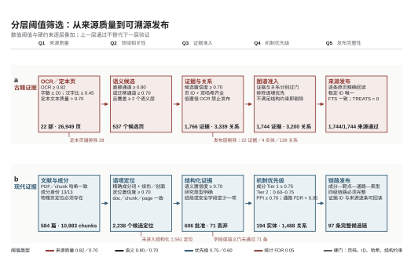

# AncientMedRAG

AncientMedRAG 是面向中药烧伤研究的本地可追溯 RAG 与证据图谱工程。系统同时处理现代 PDF 文献和古籍页级文本，使用 SQLite FTS5、Qwen3-Embedding-8B、FAISS、RRF 与 Qwen3-Reranker-8B 完成检索，并保留从答案候选回到原文件、原页和原文的完整定位信息。

项目只提供命令行工具，不启动网页服务，不依赖收费 API，也不内置回答大模型。Git 仓库包含复现代码、固定配置、模型版本锁和数据契约；原始 PDF、OCR 结果、SQLite 数据库、模型权重和向量索引由使用者在本地生成。

## 核心能力

- 现代文献：PDF 清点、逐页提取、稳定 ID、切块、质量检查、FTS5 与 Qwen 向量索引。
- 古籍文献：PaddleOCR 页级识别、版面文本固化、Kanripo 定本导入、页级 FTS5 与 Qwen 向量索引。
- 双库检索：现代、古籍或双库模式，关键词、向量及重排混合检索。
- 原文溯源：返回 `doc_id`、`chunk_id`、`book_id`、`page_id`、物理页码、文件哈希和原文片段。
- 分层自动筛选：来源质量、领域语义、证据准入、机制优先级和发布完整性分别执行数值阈值与硬约束；全流程不依赖人工批准。
- 领域规则：39 条烧伤术语覆盖 123 个词形、6 类语义层和 4 类证据通道，并执行上下文与排除语境优先规则。
- 方剂消歧：以来源页和组成指纹区分《医学心悟》第 138 页与第 227 页两个忍冬汤变体，低置信度剂量不进入发布断言。
- 五层图谱：古籍、方剂/成分、靶点、通路和烧伤表型的稳定实体与证据限定关系。
- 标准导出：不可变 JSONL、Neo4j CSV/Cypher、JSON-LD 和 SHA-256 清单。

## 技术结构

```text
现代 PDF ---------------------------> documents / pages / chunks
                                            |        |
古籍 PDF -> PaddleOCR -> pages -------------+        +-> SQLite FTS5
Kanripo 定本 -> 页锚点 -> pages -------------+        +-> Qwen3 / FAISS
                                                     |
                                      FTS5 + FAISS -> RRF -> Reranker
                                                     |
                                             可定位检索结果
                                                     |
                        置信度门 + 源回读验证 -> 证据包 -> 五层知识图谱
```

## 分层阈值筛选

项目不使用单一 `0.7` 覆盖全部阶段。古籍 OCR 页质量门为平均识别置信度 `>= 0.82`，同时要求可见字符数 `>= 20`、汉字比例 `>= 0.45`；Kanripo 定本文本质量采用严格大于 `0.70`。领域相关性阶段中，直接烧伤通道要求得分 `>= 0.80`，机制迁移通道要求得分 `>= 0.70` 且覆盖至少两个语义层。候选证据发布门保持 `>= 0.70`，但还必须通过页码、稳定 ID、来源哈希、正文哈希和排除语境检查。

现代证据先执行成分词、烧伤或创面语境、文档/文本块/物理页一致性及定位置信度 `>= 0.70`；结构化证据还需语义置信度 `>= 0.70`，并具备明确研究类型以及结局或安全字段。机制优先级使用成分 Tier 1 `>= 0.75`、Tier 2 `0.60-0.75`、PPI `>= 0.70` 和通路 FDR `< 0.05`。最终发布是非数值硬门：来源必须逐条回读，ID 必须唯一，数据库与 FTS 计数必须一致，完整机制链不得缺少任一层，自动 `TREATS` 关系必须为 0。



阈值、硬约束和冻结统计集中保存在 `research_pipeline/data/layered_thresholds_v1.json`。以下命令验证策略及其与术语本体、忍冬汤证据包的一致性：

```bash
python -m research_pipeline.layered_thresholds
python -m research_pipeline.validate_domain_assets
```

主要目录：

- `app/`：RAG 命令行、文本处理、索引、检索和评测。
- `ancient_ocr/`：古籍 OCR、Kanripo 定本获取与页库构建。
- `knowledge_graph/`：图谱模型、稳定 ID、验证和标准导出。
- `research_pipeline/`：古籍证据抽取、方剂消歧和合并发布。
- `discovery_pipeline/`：现代证据扫描、成分筛选和候选机制链。
- `docs/REPRODUCE.md`：从空目录到可查询 RAG 的完整复现步骤。

## 快速开始

建议使用 Python `3.11`，Qwen 主通道使用 CUDA `12.8` 兼容环境。

```bash
git clone <repository-url> AncientMedRAG
cd AncientMedRAG
python3.11 -m venv .venv
source .venv/bin/activate
python -m pip install --upgrade pip
python -m pip install -r requirements-gpu.txt
python app/scripts/download_models.py --profile qwen
```

Windows PowerShell 激活命令为 `.venv\Scripts\Activate.ps1`。将现代 PDF 放入 `corpus/modern_pdf/`，可选元数据表放入 `corpus/modern_metadata.csv`，然后执行：

```bash
python app/rag_cli.py inventory
python app/rag_cli.py extract
python app/rag_cli.py chunk
python app/rag_cli.py repair
python app/rag_cli.py validate
python app/rag_cli.py index
python app/rag_cli.py embed-qwen
python app/scripts/freeze_corpus.py --config app/config.yaml
```

古籍页库构建、十部 Kanripo 定本导入以及古籍 Qwen 索引命令见 [复现指南](docs/REPRODUCE.md)。

## 查询与溯源

```bash
python app/rag_cli.py query --mode modern \
  --retrieval qwen-reranked-hybrid "绿原酸促进创面修复的机制"

python app/rag_cli.py query --mode ancient \
  --retrieval qwen-reranked-hybrid "忍冬 汤火伤"

python app/rag_cli.py query --mode dual \
  --retrieval qwen-reranked-hybrid "金银花 甘草 烧伤 创面修复"

python app/rag_cli.py source --mode auto --doc-id DOC_ID --page 20
python app/rag_cli.py doctor --deep
```

`source` 按稳定 ID 和物理页码回读 SQLite 原文。`doctor --deep` 校验源文件集合、JSONL、SQLite、FTS5、冻结清单、模型指纹、FAISS 条目和 ID 映射。

分层阈值、领域规则和忍冬汤证据链可独立校验：

```bash
python -m research_pipeline.validate_domain_assets
```

校验器核对 12 个阶段门、6 个不同数值阈值、硬约束、术语标识、词形冲突、来源页、组成指纹、同名异方关系和 E1/E5 证据边界；任一约束不满足即返回非零退出码。

## 参考输出

使用项目对应的 584 篇现代 PDF、12 部基础古籍 PDF、锁定的 10 部 Kanripo 定本及 `app/models.lock.json` 中的模型版本，可得到以下参考规模：

| 产物 | 数量 |
| --- | ---: |
| 现代文献 | 584 篇、9,870 页、10,983 chunks |
| 古籍文献 | 22 部、26,949 页 |
| 古籍图谱 | 613 个实体、1,744 条证据、3,200 条关系 |
| 现代图谱 | 194 个实体、606 条证据、1,488 条关系 |
| 合并图谱 | 807 个实体、2,350 条证据、4,688 条关系 |
| 候选机制链 | 97 条成分-靶点-通路-表型链 |

固定 52 题古籍回归中，Qwen 重排混合检索的 Recall@10 为 `0.9565`、MRR@10 为 `0.8200`、页码定位率为 `1.0`、拒答准确率为 `1.0`。240 题书名与主题词来源定位集的 Recall@10 为 `0.9955`；该指标衡量结构化来源定位，不代表纯向量性能。

仓库不分发受版权或许可限制的原始资料，因此只有在输入文件、定本提交、模型版本和配置一致时，数量与指标才应逐项一致。使用其他资料时，代码流程、数据结构和完整性检查仍可复现，但结果规模会随输入变化。

## 科学边界

机器批准表示记录通过可复算的置信度与来源门，不表示直接靶点结合、药效、安全性或临床获益已经得到实验确认。自动图谱不生成 `TREATS` 关系，候选机制链也不能替代化学鉴定、体内外实验、毒理、药代或临床研究。本项目不提供诊疗建议。
